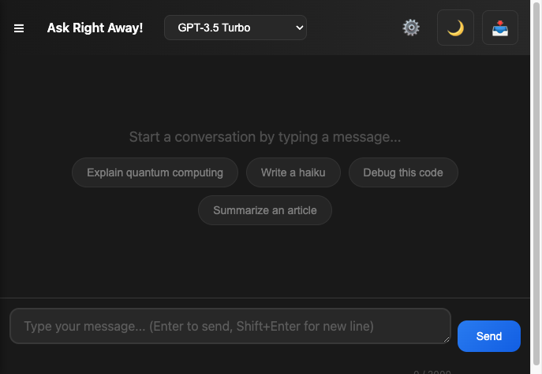

# QuickGPT

A fast, modern AI chat interface with markdown support, dark/light theme, and Netlify serverless backend (OpenAI GPT-3.5 & Claude).



## Features

- **Chat** – Multi-turn conversation with conversation history sent to the API
- **Markdown & code** – AI replies rendered as markdown with Prism.js syntax highlighting
- **Multi-line input** – Textarea with Enter to send, Shift+Enter for new line (max 2000 chars)
- **Suggested prompts** – Example questions on empty state to get started
- **Regenerate** – Regenerate the last AI response for any message
- **Stop** – Cancel in-flight requests
- **Copy** – Copy user or AI messages to clipboard
- **Delete** – Remove a user/AI pair from the thread (and history)
- **Export** – Download chat as JSON, TXT, Markdown, or all three (dropdown)
- **Persistent chat** – Conversation saved in `localStorage` and restored on refresh
- **New chat** – Clear thread and history; shortcut **⌘K** / **Ctrl+K**
- **Theme** – Light/dark toggle (preference stored in `localStorage`)
- **429 retry** – On rate limit, toast with “Retry” to resend the last message
- **Scroll to bottom** – Button appears when scrolled up; click to jump to latest
- **Accessibility** – ARIA labels, roles, keyboard (Escape clears input)

## Setup

1. **Clone and install**

   ```bash
   git clone https://github.com/jovylle/chat.git
   cd chat
   npm install
   ```

2. **OpenAI API key**

   - Get an API key from [OpenAI](https://platform.openai.com/api-keys).
   - In Netlify: **Site settings → Environment variables** add:
     - `MY_OPENAI_API` = your OpenAI API key

3. **Run locally (Netlify Dev)**

   ```bash
   npx netlify dev
   ```

   Or serve the `public` folder (e.g. `npx serve public`) and call the deployed `/.netlify/functions/chat` if already live.

4. **Deploy**

   Connect the repo to Netlify; build command can be empty, publish directory: `public`, functions: `netlify/functions`.

## Project structure

- `public/` – Static frontend (`index.html`, `prism.js`, `prism.css`)
- `netlify/functions/chat.js` – Serverless function that proxies requests to OpenAI
- `netlify.toml` – Netlify config (build, redirects, headers)

## License

MIT · [jovylle](https://github.com/jovylle)
