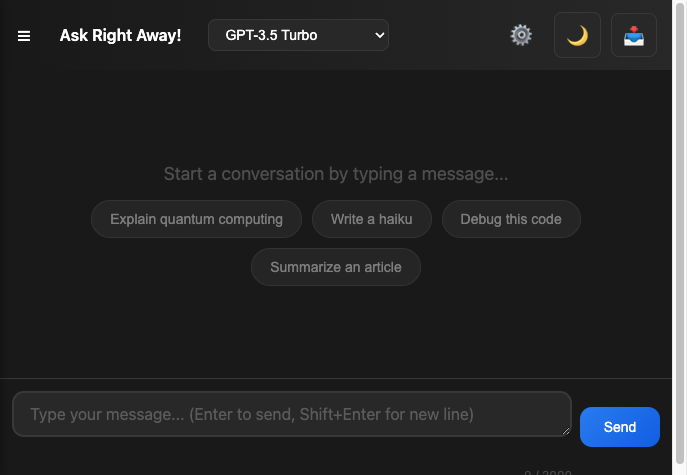

# Chat Assistant Box

A fast, modern AI chat interface with markdown support, dark/light theme, Netlify serverless backend (OpenAI GPT-3.5 & Claude), and progressive web app polish.



## Features

- **Chat** – Multi-turn conversations with OpenAI Claude and GPT-3.5 models
- **Markdown & code** – AI replies rendered as markdown with Prism.js syntax highlighting and copy buttons
- **Drafts per conversation** – Inputs are auto saved locally per chat
- **Quick replies** – Suggested follow-up prompts (“Explain simpler”, “Give examples”, etc.)
- **Message edit & resend** – Edit any user message and regenerate from that point
- **Regenerate / stop** – Regenerate the last AI response or cancel in-flight requests
- **Read aloud** – Listen to any AI reply with Web Speech API voice controls
- **Conversation management** – Rename, pin, delete, reorder via searchable sidebar
- **Export & copy** – Download chat history (JSON/TXT/MD) and copy individual responses
- **PWA-ready** – Manifest + service worker + install prompt keep the UI installable on mobile
- **Keyboard-aware layout** – Input stays visible above the Android keyboard with soft scrolling tweaks
- **Accessibility** – ARIA labels, roles, keyboard support (Escape clears input)
- **Retry toast** – “Retry” button surfaces automatically on rate limits (429)

## Live preview

- Web app: [https://chat.uft1.com](https://chat.uft1.com)
- Legacy vanity hosts now redirect to the new domain via Netlify config above
- More projects and info: [https://jovylle.com](https://jovylle.com)

## Setup

1. **Clone and install**

   ```bash
   git clone https://github.com/jovylle/chat.git
   cd chat
   npm install
   ```

2. **OpenAI API key**

   - Get an API key from [OpenAI](https://platform.openai.com/api-keys).
   - In Netlify: **Site settings → Environment variables** add:
     - `MY_OPENAI_API` = your OpenAI API key

3. **Run locally (Netlify Dev)**

   ```bash
   npx netlify dev
   ```

   Or serve the `public` folder (e.g. `npx serve public`) and point to the deployed `/.netlify/functions/chat` if already live.

4. **Deploy**

   Connect the repo to Netlify; build command can be empty, publish directory: `public`, functions: `netlify/functions`. Netlify’s redirect rules ensure the SPA works and legacy hosts keep pointing to `chat.uft1.com`.

## API configuration

The UI talks to `/.netlify/functions/chat`. Netlify reads `MY_OPENAI_API` (and optionally `MY_CLAUDE_API`) from your site settings, so the default experience uses keys you control in production. For personal devices you can also run the chat with your own OpenAI or Anthropic key, and that key is used to call the provider endpoints directly from your browser:

- Open the gear icon in the top-right, toggle **Use Your Own API Key**, select the provider, and paste your key (`sk-...` for OpenAI, whatever Anthropic provides).
- Choose any supported model (GPT-3.5, GPT-4, GPT-4o, Claude 3.x) and optionally enter custom system instructions—those settings are saved to `localStorage`.
- The key never leaves your browser storage; when the custom key toggle is active the browser calls OpenAI or Anthropic directly, so our Netlify proxy never sees or logs it.

Need to rotate your own key? Clear all data in the settings menu and re-enter a fresh key (or just toggle the custom key switch off).

## Privacy policy

A policy page lives at `https://chat.uft1.com/privacy-policy/` (also deployable via `public/privacy-policy/index.html`). It documents:

- What data the Netlify function sees (messages, optional history, provider choice, timestamps).
- How conversation history, drafts, and API preferences stay in `localStorage` only, and how you can clear them from settings.
- That custom API keys are kept on-device and the proxy forwards requests securely to OpenAI/Anthropic without storing them.
- Contact details (GitHub issues or https://jovylle.com) in case reviewers need clarification for Google Play.

## Android app (APK/AAB for Google Play)

The app is a PWA; to publish on Google Play you need an Android package (AAB preferred, or APK). Easiest path:

1. **PWA Builder (recommended)**  
   - Go to [pwabuilder.com](https://www.pwabuilder.com/).  
   - Enter your live URL: `https://chat.uft1.com`.  
   - Click **Start**, then **Package for stores** → **Android** → follow the flow.  
   - Download the generated Android project or signed AAB/APK. To keep the AAB in this repo (one-time), copy the `.aab` file into the **`releases/`** folder (see `releases/README.md`).  
   - For Play Store: upload the **AAB** in [Play Console](https://play.google.com/console) → your app → **Production** → **Create new release** → upload the AAB.

2. **Optional: TWA with Bubblewrap (reproducible build)**  
   - Install: `npm i -g @bubblewrap/cli`, then `bubblewrap init`.  
   - Use manifest URL: `https://chat.uft1.com/manifest.webmanifest`.  
   - Complete the wizard (package ID e.g. `com.uft1.chatassistantbox`), then build:  
     `bubblewrap build` (produces AAB/APK in the project output folder).  
   - Sign the AAB with your Play upload key (Bubblewrap can generate a key or use an existing one).

After deploying any manifest changes, re-run PWA Builder or Bubblewrap so the store package uses the updated PWA.

## Project structure

- `public/` – Static frontend (`index.html`, `prism.js`, `prism.css`)
- `netlify/functions/chat.js` – Serverless function that proxies requests to OpenAI
- `netlify.toml` – Netlify config (build, redirects, headers)

## License

MIT · [jovylle](https://github.com/jovylle)
